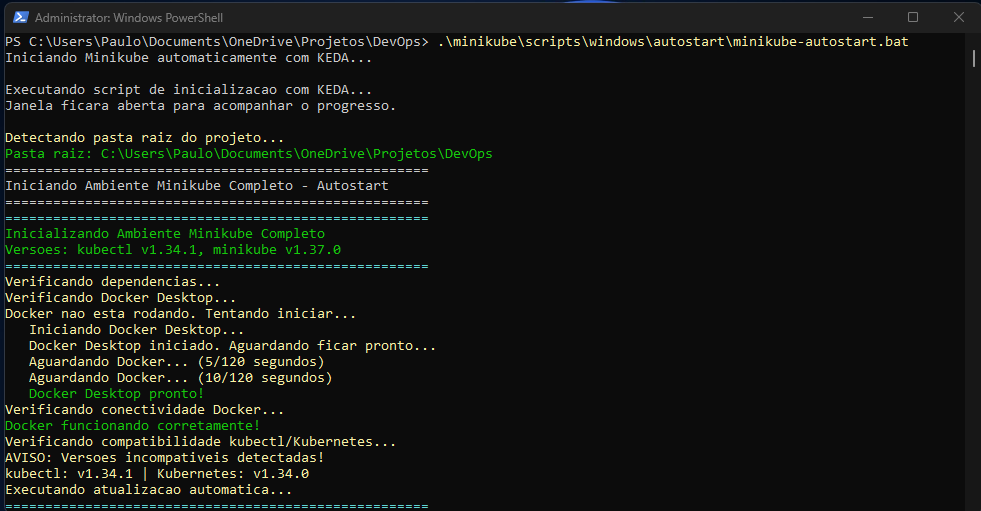
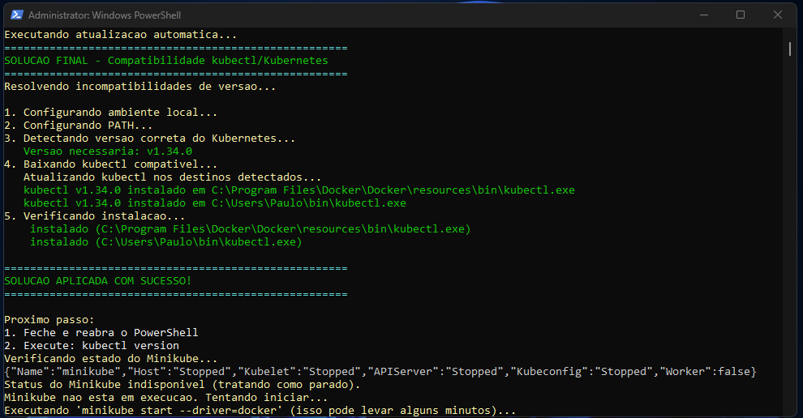
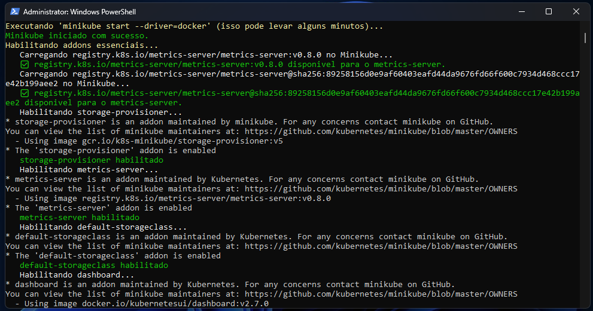
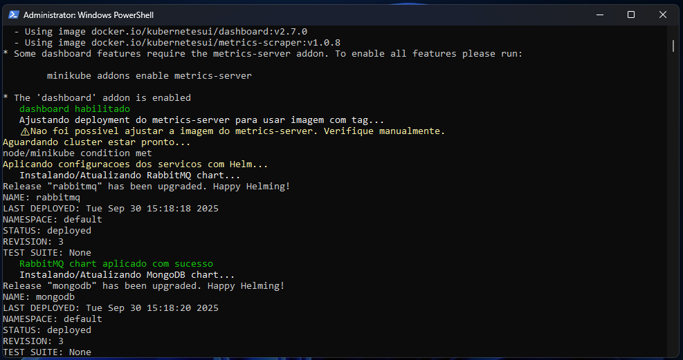
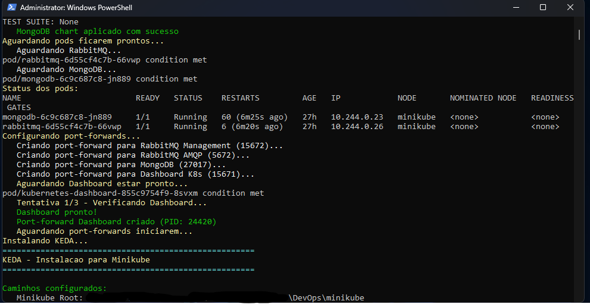
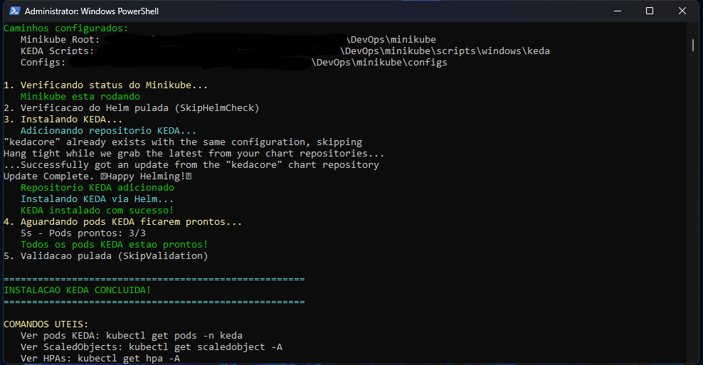
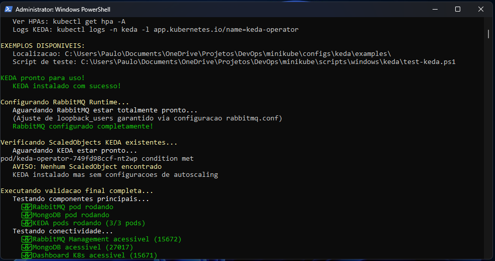
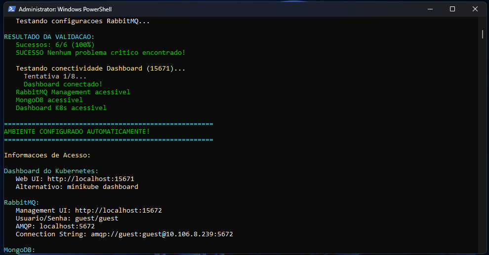
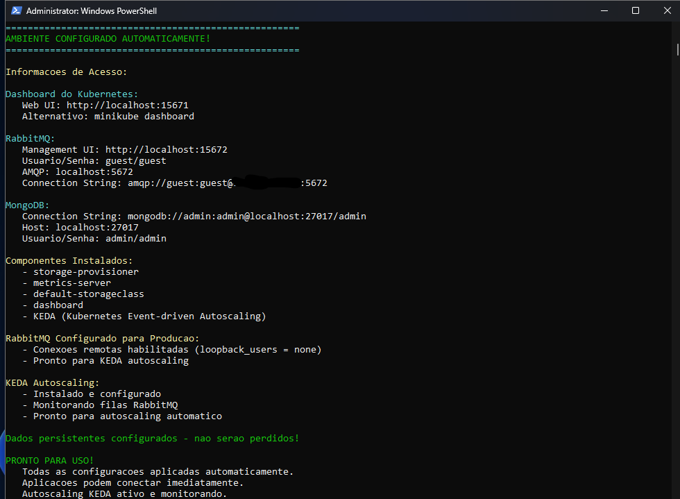

# Minikube DevOps Environment


Ambiente profissional para desenvolvimento, testes e automação DevOps local usando Minikube, RabbitMQ, MongoDB, Redis e KEDA. Inclui scripts prontos para Windows e Linux.

Professional environment for local DevOps automation, development, and testing with Minikube, RabbitMQ, MongoDB, Redis, and KEDA. PowerShell and Bash scripts are provided out of the box.

---


## Visão Geral (PT-BR)
- Automação completa do setup Kubernetes local com Minikube
- RabbitMQ, MongoDB e Redis configurados automaticamente com persistência de dados
- KEDA para autoscaling baseado em eventos (RabbitMQ, CPU, memória, etc.)
- Scripts PowerShell e Bash para inicialização, manutenção, monitoramento e troubleshooting
- Estrutura profissional: desenvolvimento em `temp/`, código consolidado na raiz do repositório
- Aplicações empacotadas como charts Helm para garantir versionamento

## Overview (EN)
- Full automation of local Kubernetes setup with Minikube
- RabbitMQ, MongoDB, and Redis provisioned automatically with persistent storage
- KEDA for event-driven autoscaling (RabbitMQ, CPU, memory, and more)
- PowerShell and Bash tooling for initialization, maintenance, monitoring, and troubleshooting
- Professional repo layout: experiments live in `temp/`, stable code lives at repository root
- Workloads delivered via Helm charts for repeatable installs

---

## Estrutura do Projeto | Project Structure
```
DevOps/
  temp/                       # Area de desenvolvimento | Development area
  charts/                     # Helm charts das aplicacoes | App charts
  docs/                       # Documentacao             | Documentation
  scripts/                    # Scripts Windows e Linux  | Scripts
  windows-test-structure.ps1
  linux-test-structure.sh
  ...
```

---


## Como Usar | How to Use
1. Clone o repositório | Clone the repository
  ```bash
  git clone https://github.com/pauloeugenioreis/minikube-devops.git
  ```
2. Revise a documentação em `docs/` antes de qualquer mudança | Review documentation in `docs/` before changing anything
3. Inicialize o ambiente | Initialize the environment
  - Windows: execute os scripts em `scripts/windows/`
  - Linux: use os scripts em `scripts/linux/`
4. Configure autostart se desejar | Optionally configure autostart (`scripts/windows/autostart/`)
5. Consulte `docs/` para detalhes, troubleshooting e exemplos | See docs for details, troubleshooting, and examples

---


## Principais Comandos | Main Commands

### Windows
```powershell
# Inicialização completa (KEDA habilitado por padrão)
./scripts/windows/init/init-minikube-fixed.ps1
# Para pular o KEDA use:
./scripts/windows/init/init-minikube-fixed.ps1 -InstallKeda:$false

# Teste de estrutura
./windows-test-structure.ps1

# Status rápido
./scripts/windows/maintenance/quick-status.ps1
```

### Linux
```bash
# Inicialização completa
bash scripts/linux/init/init-minikube-fixed.sh

# Teste de estrutura
bash linux-test-structure.sh

# Status rápido
bash scripts/linux/quick-status.sh
```

---


## Licença | License
Este projeto é aberto para uso pessoal ou profissional.
This project is open for personal or commercial usage.

---

## Imagens do Projeto

Imagens ilustrativas do ambiente e dos principais componentes:

<p align="center">
  
  
  
  
  
  
  
  
  
</p>
