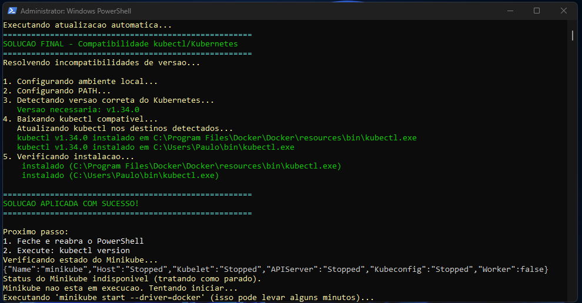

# Minikube DevOps Environment

Ambiente profissional para desenvolvimento, testes e automacao DevOps local usando Minikube, RabbitMQ, MongoDB e KEDA. Inclui scripts prontos para Windows e Linux.

Professional environment for local DevOps automation, development, and testing with Minikube, RabbitMQ, MongoDB, and KEDA. PowerShell and Bash scripts are provided out of the box.

---

## Visao Geral (PT-BR)
- Automacao completa do setup Kubernetes local com Minikube
- RabbitMQ e MongoDB configurados automaticamente com persistencia de dados
- KEDA para autoscaling baseado em eventos (RabbitMQ, CPU, memoria, etc.)
- Scripts PowerShell e Bash para inicializacao, manutencao, monitoramento e troubleshooting
- Estrutura profissional: desenvolvimento em `temp/`, codigo consolidado em `minikube/`
- Aplicacoes empacotadas como charts Helm para garantir versionamento

## Overview (EN)
- Full automation of local Kubernetes setup with Minikube
- RabbitMQ and MongoDB provisioned automatically with persistent storage
- KEDA for event-driven autoscaling (RabbitMQ, CPU, memory, and more)
- PowerShell and Bash tooling for initialization, maintenance, monitoring, and troubleshooting
- Professional repo layout: experiments live in `temp/`, stable code in `minikube/`
- Workloads delivered via Helm charts for repeatable installs

---

## Estrutura do Projeto | Project Structure
```
DevOps/
  temp/                       # Area de desenvolvimento | Development area
  minikube/                   # Estrutura principal      | Main structure
    charts/                   # Helm charts das aplicacoes | App charts
    docs/                     # Documentacao             | Documentation
    scripts/                  # Scripts Windows e Linux  | Scripts
    windows-test-structure.ps1
  MANDATORY-CHECKLIST.md
  DECISIONS-HISTORY.md
  ...
```

---

## Como Usar | How to Use
1. Clone o repositorio | Clone the repository
   ```
   git clone https://github.com/pauloeugenioreis/minikube-devops.git
   ```
2. Revise o `MANDATORY-CHECKLIST.md` antes de qualquer mudanca | Review `MANDATORY-CHECKLIST.md` before changing anything
3. Inicialize o ambiente | Initialize the environment
   - Windows: execute os scripts em `minikube/scripts/windows/`
   - Linux: use os scripts em `minikube/scripts/linux/`
4. Configure autostart se desejar | Optionally configure autostart (`minikube/scripts/windows/autostart/`)
5. Consulte `minikube/docs/` para detalhes, troubleshooting e exemplos | See docs for details, troubleshooting, and examples

---

## Principais Comandos | Main Commands

### Windows
```powershell
# Inicializacao completa (KEDA habilitado por padrao)
.\minikube\scripts\windows\init\init-minikube-fixed.ps1
# Para pular o KEDA use: .\minikube\scripts\windows\init\init-minikube-fixed.ps1 -InstallKeda:$false

# Teste de estrutura
.\minikube\windows-test-structure.ps1

# Status rapido
.\minikube\scripts\windows\maintenance\quick-status.ps1
```

### Linux
```bash
# Inicializacao completa
bash minikube/scripts/linux/init/init-minikube-fixed.sh

# Teste de estrutura
bash minikube/linux-test-structure.sh

# Status rapido
bash minikube/scripts/linux/quick-status.sh
```

---

## Licenca | License
Este projeto e aberto para uso pessoal ou profissional.
This project is open for personal or commercial usage.

---

## Imagens do Projeto

Imagens ilustrativas do ambiente e dos principais componentes:

<p align="center">
  
  
  
  
  
  
  
  
  
</p>
